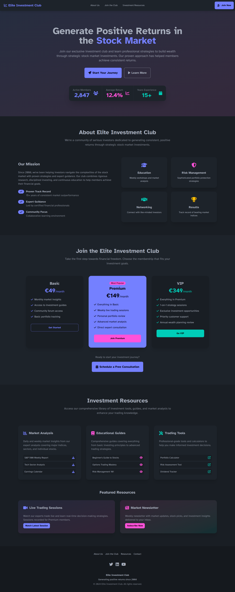

# Professional Investment Club Website

## Demo Website Features
The single HTML file includes all requested sections plus modern enhancements:

## Technical Implementation:
- ✅ Tailwind CSS for responsive design
- ✅ DaisyUI for professional components
- ✅ Atkinson font for accessibility
- ✅ FontAwesome icons throughout
- ✅ Single file - completely self-contained
- ✅ Option to add Supabase for database

## Core Sections:
1. About Us - Professional mission, track record, and key benefits
2. Join the Club - Three membership tiers with clear pricing
3. Investment Resources - Organized tools, guides, and analysis

## Professional Features:
- Responsive design for all devices
- Smooth scrolling navigation
- Interactive elements and hover effects
- Professional color scheme and typography
- Trust-building elements (statistics, testimonials)
- Clear call-to-action buttons

## Optional Supabase Integration:
The current demo uses static content, but it can be easily integrate with Supabase for:
- Dynamic resource management
- Member registration
- Content delivery

## Timeline & Budget
- Approximately 1 month to be ready.
- Supabase integration adds 1-2 weeks time.
- About 500-600$

## Clarifications:
### Technical Questions:
- Content management
- Authentication
- Payments
- Forms

### Business Questions:
- Existing branding guidelines (colors, fonts, logo)?
- Integration needs with existing systems (CRM, email marketing)?
- Legal compliance requirements (GDPR, financial regulations)?

### Content Questions:
- Will content be provided?
- Photo/image requirements
- How many resources? Kind of resources?

### Timeline Questions:
- Hard deadline or flexible?
- Post-launch maintenance/updates needed?

## NOTE
Each project is unique. Estimated time and/or cost might change due to project's requirements, unexpected issues, client's feedback cycles and testing phases.
